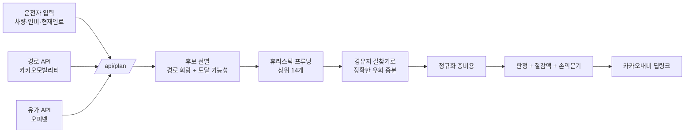

# 경로 내 최저가 주유 추천 — 설계와 위험 분석

고유가 상황에서 운전자가 실제로 절약할 수 있게 하려면 "리터당 가장 싼 주유소"를
찾아주면 안 된다. 그건 거의 항상 틀린 답이다. 이 문서는 무엇을 계산해야 하는지,
무엇을 먼저 결정해야 하는지, 그리고 어디서 사람이 다치거나 앱이 사용자를
속이게 되는지를 정리한다.

---

## 1. 왜 가격 비교만으로는 틀리는가

리터당 40원 싼 주유소를 찾았다고 하자. 40L를 넣으면 1,600원을 번다.
그런데 그 주유소가 경로에서 편도 3km 벗어나 있으면:

- 왕복 6km를 더 달린다. 연비 11km/L, 리터당 1,650원이면 **900원**이 연료로 사라진다.
- 도심 우회에 8분이 걸린다. 시간을 분당 150원으로 보면 **1,200원**이다.
- 고속도로였다면 진출·재진입 통행료가 **900원** 붙는다.

합계 3,000원을 써서 1,600원을 벌었다. **1,400원 손해**다.
이 계산을 사용자가 머릿속으로 할 수 없기 때문에 이 앱이 필요하다.
그리고 이 계산을 앱이 대충 하면, 앱은 사용자를 손해 보게 만드는 도구가 된다.

---

## 2. 비용 모델

### 2.1 비교의 기준을 통일한다

서로 다른 주유소를 비교하려면 **"도착 시 연료 상태"를 같게 맞춰야** 한다.
그러지 않으면 가득 채운 시나리오가 항상 비싸 보이고, 조금만 넣은 시나리오가
항상 싸 보인다. 남는 연료는 버린 돈이 아니고, 모자란 연료는 어차피 나중에
사야 하는 돈이다.

기호:

| 기호 | 의미 |
| --- | --- |
| $D$ | 기본 경로 거리 (km) |
| $d_s$ | 주유소 $s$를 경유할 때 늘어나는 거리 (km) |
| $t_s$ | 늘어나는 시간 (분) |
| $e$ | 실주행 연비 (km/L) |
| $f_0$ | 현재 연료량 (L) |
| $r$ | 목적지 도착 시 남길 예비량 (L) |
| $C$ | 탱크 용량 (L) |
| $p_s$ | 할인 적용 후 실지불 단가 (원/L) |
| $p_{ref}$ | 경로 주변 시세 중위값 (원/L) |
| $w$ | 시간의 가치 (원/분) |
| $L_s$ | 실제 주입량 (L) |

정규화 총비용:

$$
\text{Cost}(s) = p_s L_s + w\,t_s + \Delta\text{toll}_s + p_{ref}\,\text{shortfall}_s - p_{ref}\,\text{surplus}_s
$$

$$
\text{end}_s = f_0 + L_s - \frac{D + d_s}{e}, \quad
\text{surplus}_s = \max(0, \text{end}_s - r), \quad
\text{shortfall}_s = \max(0, r - \text{end}_s)
$$

**우회 연료비를 따로 더하지 않는다.** 총 주행거리 $D + d_s$에 우회가 이미
포함되어 있어서 주입량 계산에 반영되고, 고정량·고정금액 주유에서는 잉여/부족
항목이 그 차이를 흡수한다. 따로 더하면 이중 계상이다.

구현: [src/lib/domain/cost.ts](../src/lib/domain/cost.ts)

### 2.2 정규화가 맞는지 판별하는 불변식

같은 시세($p_s = p_{ref}$)에서라면 **가득 주유와 필요량 주유의 실질 비용이
같아야 한다**. 이게 깨지면 모델이 틀린 것이다.
테스트로 고정해 두었다: [cost.test.ts](../src/lib/domain/cost.test.ts)의
`같은 시세라면 가득 주유와 필요량 주유의 실질 비용이 같다`.

### 2.3 손익분기 우회거리

사용자에게 결론만 던지면 신뢰하지 않는다. "왜"를 숫자로 줘야 한다.

$$
d^{*} = \frac{(p_{base} - p_s)\,L_s}{\dfrac{p_s}{e} + \dfrac{60w}{v}}
$$

리터당 50원 싼 곳에서 20L를 넣고, 연비 12km/L, 단가 1,700원, 시간 가치 0이면
$d^{*} \approx 7.1\text{km}$다. 시간을 분당 300원으로 보면 3km 아래로 떨어진다.
**대부분의 우회는 손해**라는 사실이 이 식에서 바로 나온다.

### 2.4 안전 제약 — 도달 가능성

$$
f_0 - \frac{\text{along}_s + d_s/2}{e} \geq 0
$$

이 조건을 만족하지 않는 주유소는 후보에서 **제외**한다. 이걸 놓치면 앱이
사용자를 길 한가운데 세운다. 탱크의 8% 미만으로 도착하는 경우에도 경고를 띄운다.

### 2.5 절감액을 정직하게 말하기

두 가지 장치를 넣었다.

1. **비관 시나리오**: 연비 -15%, 대상 주유소 가격 +25원/L, 우회거리 +25%로
   다시 계산한다. 이 조건에서 절감액이 0 이하면 "오차 범위 안쪽"으로 판정하고
   우회를 권하지 않는다.
2. **재고 선구매분 분리**: 가득 주유의 절감액 중 상당 부분은 가격차가 아니라
   물량에서 나온다. 시세보다 싼 연료를 미리 채워둔 값은 실제 이득이지만
   *지금 지갑에서 덜 나가는 돈은 아니다*. 섞어서 보여주면 과장이다.

### 2.6 판정 결과

| 판정 | 의미 |
| --- | --- |
| `detour-worth-it` | 우회가 분명히 이득 |
| `marginal` | 계산상 이득은 있으나 모델 오차에 묻힌다 |
| `stay-on-route` | 가장 가까운 주유소가 이미 최선 |
| `no-refuel-needed` | 이번 구간은 주유가 필요 없다 |
| `no-candidates` | 조건에 맞는 후보가 없다 |

**"추천 안 함"도 정답이다.** 항상 무언가를 추천하는 앱은 사용자를 손해 보게 한다.

---

## 3. 데이터 소스와 실제 제약

### 3.1 오피넷 (한국석유공사 유가정보 오픈 API)

| 항목 | 내용 |
| --- | --- |
| 반경 검색 | `aroundAll.do`, **반경 최대 5,000m** |
| 좌표계 | **KATEC**. WGS84를 그대로 넣으면 엉뚱한 지역이 나온다 |
| 유종 코드 | `B027` 휘발유, `B034` 고급휘발유, `D047` 경유, `K015` 자동차부탄 |
| 정렬 | `sort=1` 가격순, `sort=2` 거리순 |
| 응답 | 주유소코드, 상표, 상호, 판매가격, 거리, KATEC 좌표 |

걸림돌:

- **5km 상한 때문에 장거리 경로를 한 번에 덮을 수 없다.** 경로를 잘게
  샘플링해 여러 번 호출해야 하고, 원 사이에 빈틈이 생기지 않도록 간격을 반경보다
  촘촘하게 잡아야 한다. 서울–대전 155km면 10회 이상이다.
- **좌표 변환에서 datum을 빼면 약 70m가 밀린다.** `towgs84` 파라미터를 반드시
  명시해야 한다. 70m는 "길 건너편"을 만들어내는 거리다.
- **`aroundAll.do` 응답에는 셀프 여부와 영업시간이 없다.** 필요하면 후보를 줄인
  뒤 `detailById.do`로 개별 조회해야 한다. 즉 후보 수 = 추가 호출 수다.
- **가격은 주유소가 신고한 값**이고 갱신은 일 단위다. 현장 가격과 다를 수 있다.

구현: [opinet/station-provider.ts](../src/lib/providers/opinet/station-provider.ts)

### 3.2 카카오모빌리티 길찾기

| 항목 | 내용 |
| --- | --- |
| 자동차 길찾기 | 1일 10,000건, 경유지 최대 5개 |
| 다중 경유지 길찾기 | 1일 5,000건, 경유지 최대 30개 |
| 유료 전환 | 자동차 길찾기 건당 8원, 다중 경유지 건당 16원 |
| 무료 한도 초과 | **응답이 끊긴다** (경고 후 차단이 아니라 이용 불가) |
| 유용한 옵션 | `priority`, `avoid`(유턴/유료도로/자동차전용), `car_fuel`, `car_hipass` |
| 응답 | `summary.distance`, `duration`, `fare.toll`, 구간별 `roads.vertexes` |

걸림돌:

- **후보를 한 요청에 몰아넣으면 안 된다.** 경유지를 30개 넣으면 "그 30곳을 다
  도는 경로"가 나온다. 우회 증분은 후보마다 별도 요청으로 구해야 한다.
- 따라서 **사용자 한 명의 한 번 조회가 후보 개수만큼 쿼터를 태운다.** 값싼
  휴리스틱으로 먼저 줄이고 상위 N개만 정확히 계산해야 한다
  (현재 `MAX_EXACT_DETOUR_CANDIDATES = 14`).
- 좌표는 `x=경도, y=위도` 순서다. 헷갈리면 조용히 틀린다.

구현: [kakao/route-provider.ts](../src/lib/providers/kakao/route-provider.ts)

### 3.3 키 없이도 끝까지 동작해야 한다

프로바이더를 인터페이스로 분리했다
([providers/types.ts](../src/lib/providers/types.ts)). 키가 없으면 결정론적
샘플 데이터로 동작하고, 키를 넣으면 실데이터로 갈아탄다. 이유는 세 가지다.

1. 비용 모델을 API 없이 검증할 수 있다.
2. 쿼터가 마르거나 API가 죽어도 화면이 백지가 되지 않는다.
3. 실데이터의 제약(반경 상한, 호출 수, 좌표계)을 샘플 프로바이더가 흉내내므로,
   실제로 붙일 때 설계가 무너지지 않는다.

---

## 4. 구체화해야 하는 결정 사항

아래는 "정답이 하나가 아니라서 반드시 정해야 하는" 항목들이다. 지금은 모두
사용자 조정 가능한 값으로 노출했지만, 제품이 되려면 기본값을 근거와 함께
고정해야 한다.

### 4.1 목적함수

- 순수 비용 최소화인가, 비용 + 시간 가중인가, "실질 리터당 단가" 최소화인가.
- 시간의 가치를 어떻게 정할 것인가. 최저임금? 사용자 입력? 시간대별 차등?
  이 값 하나가 추천 결과를 가장 크게 흔든다.

### 4.2 주입량 정책

- 필요한 만큼 / 가득 / 고정 금액(5만원) / 고정 리터. 한국 운전자는 금액 지정이
  많다. 정책에 따라 최적 주유소가 바뀐다.
- 남는 연료의 가치를 무슨 가격으로 매길 것인가. 현재는 경로 주변 시세 중위값이다.
  목적지 주변 시세가 더 맞을 수도 있다.

### 4.3 절감액의 기준선

"3,000원 절약"은 **무엇에 비해** 절약인가. 현재는 "경로에서 가장 가까운
주유소에서 그냥 넣기"로 잡았다. 다른 후보는 전국 평균가, 목적지 도착 후 주유,
사용자가 평소 가는 주유소다. 기준선이 바뀌면 절감액 숫자가 크게 달라지므로
화면에 기준선을 명시해야 한다.

### 4.4 다회 주유

장거리에서 탱크 하나로 못 가면 두 번 이상 넣어야 하고, 이건 고전적인
**Gas Station Problem**(탱크 제약이 있는 최소 비용 주유 계획)이다. 후보를
경로 순서로 정렬한 DP나 그리디로 풀 수 있다. 현재 구현은 단일 주유 최적화이고,
탱크로 도달 불가한 후보는 제외한 뒤 부족분을 시세로 정산해 경고만 띄운다.

### 4.5 연비 추정

- 공인연비를 쓰면 절감액이 실제보다 크게 나온다. **실측값을 받아야 한다.**
- 더 나은 방법: 사용자의 주유 기록(주행거리 / 주입량)으로 학습하고, 도심·고속
  비율, 정체, 경사, 계절(에어컨·히터), 적재량으로 보정한다.
- 신뢰구간을 함께 보여줘야 한다. 점 추정만 보여주면 과신을 유발한다.

### 4.6 할인 구조

주유소 간 가격차는 보통 리터당 수십 원인데, 제휴카드 할인은 리터당 60~100원에
달할 수 있다. **할인을 빼놓고 비교하면 결론이 뒤집힌다.** 사용자의 카드·멤버십
프로필을 반드시 받아야 하고, 브랜드별 적립·제휴 조건까지 모델링해야 정확해진다.

### 4.7 실시간성

출발 전 1회 계산인가, 주행 중 재계산인가. 재계산은 쿼터와 배터리를 태우고,
무엇보다 **주행 중 화면 조작을 유도**한다. 현재는 출발 전 확정 + 외부 내비
위임으로 잡았다.

---

## 5. 위험

### 5.1 안전 — 가장 중요하다

- **운전 중 조작 유도**: 이 앱은 직접 길안내를 하지 않는다. 주유소 선택은 출발
  전에 끝내고, 실제 안내는 검증된 내비 앱(카카오내비 딥링크)에 넘긴다.
  주행 중 갱신이 필요하면 음성 안내와 큰 버튼 하나로 제한해야 한다.
- **위험한 기동 유도**: 반대편 차선 주유소는 유턴이나 회차를 요구한다. 불법
  유턴을 유도하면 사고와 법규 위반을 동시에 만든다. 진행 방향 기준 좌우를
  판별해 경고하고, 경로 API의 `avoid: uturn` 옵션을 검토해야 한다.
- **급차선 변경**: 고속도로 진출로를 늦게 안내하면 위험하다. 진출은 충분히
  앞에서 안내해야 한다.
- **연료 고갈**: 도달 가능성 검사를 절대 생략할 수 없다. 예비량을 깎아서 절감액을
  만드는 최적화는 금지다. 연료 잔량 그래프에 예비선을 그려 사용자가 눈으로
  확인할 수 있게 했다.

### 5.2 법·규제

- **위치정보법**: 이용자 위치를 수집·이용하면 위치기반서비스사업 신고 의무가
  생길 수 있다. 경로 전체는 이동 궤적이라 민감도가 높다. 가능한 계산을
  단말에서 하고, 서버 저장은 최소화·익명화해야 한다.
- **오피넷 데이터 이용 조건**: 공식 오픈 API만 쓰고(웹 크롤링 금지), 출처를
  표시하고, 상업적 재배포·재가공 제한을 확인해야 한다.
- **카카오 API 약관**: 지도 데이터의 저장·재가공, 다른 지도 위에 카카오 경로를
  표시하는 조합, 표시 의무 등을 확인해야 한다. 현재 프로토타입이 OSM 타일을
  쓰는 이유 중 하나다.
- **가격 오표기 책임**: "표시 가격은 참고용이며 현장 가격과 다를 수 있다"는
  고지를 화면에 상시 노출한다.

### 5.3 데이터 신뢰성

| 위험 | 결과 | 대응 |
| --- | --- | --- |
| 신고 가격이 하루 이상 묵음 | 도착해서 보니 더 비쌈 | 신고 시각 표시, 36시간 초과 시 경고 |
| 폐업·휴업·리모델링 | 헛걸음 | 사용자 신고 기능, 최근 갱신 이력 확인 |
| 영업시간 | 문 닫은 곳 추천 | 도착 예상 시각으로 판정 (KST 고정) |
| 재고 품절, 유종 미취급 | 헛걸음 | 유종 취급 여부 필터, 신고 기능 |
| 카드 전용가·현금가 구분 | 실제 결제액이 다름 | 결제 조건을 입력받아 반영 |

> 구현 중에 실제로 발견한 버그: 영업시간을 서버 로컬 시간대(UTC)로 판정하고
> 있었다. 한국 주유소 영업시간은 KST 기준이라 9시간이 밀려 문 닫은 주유소를
> 추천했다. `Asia/Seoul`로 고정해 해결했다.

### 5.4 모델 오차

- **직선거리로 우회를 추정하면 크게 틀린다.** 강, 중앙분리대, 일방통행, 고속도로
  진출입 때문이다. 반드시 경로 API로 실제 우회거리를 구하고, 추정치를 쓸 때는
  화면에 `추정치`임을 표시해야 한다 (현재 샘플 모드가 그렇게 동작한다).
- **연비 오차가 절감액을 잡아먹는다.** 20~30% 오차는 흔하다. 그래서 비관
  시나리오 검증을 넣었다.
- **절감액이 오차보다 작은데 추천하면 사용자가 손해를 본다.**
  `minMeaningfulSavingKrw` 아래는 추천하지 않는다.

### 5.5 유인 왜곡과 윤리

- **광고·제휴로 특정 브랜드를 밀면 앱의 존재 이유가 사라진다.** 순위에 영향을
  주는 스폰서 노출을 금지하거나, 최소한 명확히 구분 표시해야 한다.
- **주유소의 허위 저가 신고** 가능성. 사용자 신고와 실제 결제 데이터로 교차
  검증이 필요하다.
- **절감액 과장**은 단기 지표를 올리고 장기 신뢰를 파괴한다. 최악의 경우 절감액을
  함께 보여주는 것이 정직한 UI다.

### 5.6 운영

- **쿼터 소진**: 카카오는 무료 한도를 넘기면 서비스가 끊긴다. 후보 프루닝, 캐싱,
  사용자당 호출 상한, 초과 시 샘플/추정 모드로의 우아한 강등이 필요하다.
- **키 노출**: 오피넷 인증키와 카카오 REST 키는 서버에서만 쓴다. 브라우저로
  내려보내면 그대로 도용된다. 그래서 계산이 `/api/plan`에 있다.
- **캐시 전략**: 가격은 일 단위로 변하므로 지오 그리드 + 유종 단위로 캐시한다.
  경로 결과는 출발지·목적지·시간대 단위로 캐시한다.

### 5.7 범위 밖의 케이스

전기차(충전 시간과 요금제 구조가 완전히 다름), LPG(충전소 밀도가 낮음),
화물차(적재 연비, 축중, 진입 제한), 렌터카(반납 시 주유 규정). 각각 별도
모델이 필요하며, 지금 모델을 그대로 쓰면 틀린 답을 준다.

---

## 6. 검증 방법

1. **불변식 테스트** — 정규화가 깨졌는지 즉시 잡아낸다. 44개 테스트가 있다.
   `npm test`
2. **민감도 분석** — 연비·시간가치·할인액을 흔들었을 때 추천이 뒤집히는 경계를
   확인한다. 경계가 너무 예민하면 그 추천은 신뢰할 수 없다.
3. **사후 검증** — 사용자의 실제 주유 기록(주입량, 결제액, 주행거리)과 예측
   절감액을 비교한다. 예측이 체계적으로 과대하면 모델을 고쳐야 한다.
4. **A/B** — "추천 안 함"을 적극적으로 쓰는 정책이 장기 절감액과 유지율에
   어떤 영향을 주는지 확인한다.

---

## 7. 이 프로토타입에서 아직 하지 않은 것

| 항목 | 필요한 작업 |
| --- | --- |
| 다회 주유 최적화 | 후보를 경로 순서로 정렬한 DP. 탱크 제약과 예비량을 상태로 둔다 |
| 실주소·실시간 위치 입력 | 카카오 로컬 API 주소 검색, 브라우저 Geolocation |
| 연비 학습 | 주유 기록 저장과 회귀. 저장이 생기면 개인정보 설계가 필요하다 |
| 할인 프로필 | 카드·멤버십별 조건 모델링. 브랜드 조건부 할인 포함 |
| 사용자 신고 | 폐업·가격 불일치 신고와 신뢰도 가중 |
| 정체 반영 | 카카오 미래운행정보 길찾기로 시간대별 소요시간 |
| 오프라인 대비 | 마지막 계획 캐시, 통신 실패 시 표시 |
